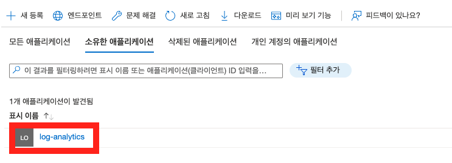

# Azure go sdk 인증 설정

## 환경변수 설정

Azure go sdk는 환경변수 값으로 인증을 시도합니다.

다음 3가지 인증 방식 중 1가지를 선택해 환경변수로 등록해줍니다.

### Service principal with secret

|variable name|value
|-|-
|`AZURE_CLIENT_ID`|ID of a Microsoft Entra application
|`AZURE_TENANT_ID`|ID of the application's Microsoft Entra tenant
|`AZURE_CLIENT_SECRET`|one of the application's client secrets

### Service principal with certificate

|variable name|value
|-|-
|`AZURE_CLIENT_ID`|ID of a Microsoft Entra application
|`AZURE_TENANT_ID`|ID of the application's Microsoft Entra tenant
|`AZURE_CLIENT_CERTIFICATE_PATH`|path to a certificate file including private key
|`AZURE_CLIENT_CERTIFICATE_PASSWORD`|password of the certificate file, if any

### Username and password

|variable name|value
|-|-
|`AZURE_CLIENT_ID`|ID of a Microsoft Entra application
|`AZURE_USERNAME`|a username (usually an email address)
|`AZURE_PASSWORD`|that user's password

인증은 작성된 순서대로 시도됩니다. 예를 들어 client secret을 사용하는 인증 방식과 certificate를 사용하는 인증 방식 대한 환경변수가 모두 있다면, client secret을 사용하는 인증 방식을 사용하게 됩니다.

자세한 내용은 [공식 github 문서](https://github.com/Azure/azure-sdk-for-go/tree/main/sdk/azidentity#environment-variables)를 참고해주세요.

## Azure Portal에서 환경변수에 필요한 값 확인하기

### AZURE_TENANT_ID 확인 방법

1. Microsoft Entra ID 메뉴로 들어갑니다.

2. 테넌트 ID를 확인합니다.

### AZURE_CLIENT_ID 확인 방법

1. Microsoft Entra ID > 앱 등록 > 새 등록

2. 생성한 앱 클릭 > 클라이언트 ID 확인

### AZURE_CLIENT_SECRET 확인 방법

1. 생성한 앱 > 인증서 및 암호 > 새 클라이언트 암호 생성 > "값" 컬럼 저장

### 등록한 앱과 Log Analytics 연결

> 앱 생성 후 Log Analytics와 연결해야 Azure sdk가 Log Analytics에 접근 가능

1. Log Analytics 작업 영역 > 액세스 제어(IAM) > 역할 할당 추가

2. 역할 할당 추가

